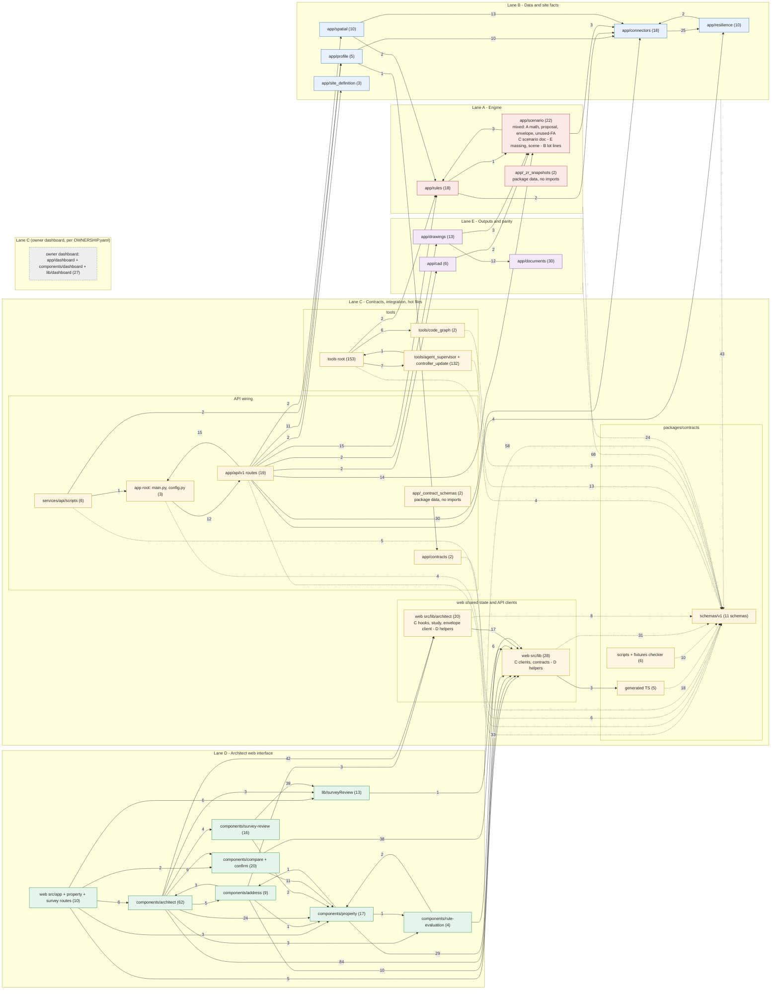

# CODE MAP — NYC Buildability (Wave 0, task M0-T162)

| Field | Value |
|---|---|
| Base commit | `2283c178` (worktree HEAD `8a813bdd` adds only project-control and docs files, so the code is identical) |
| Date | 2026-09-30 |
| Sources | Recon reports A (engine), B (data), C (integration/contracts/flags), D (web), E (outputs/CI); group graph `graph_groups.txt` from `tools/code_graph` |
| Graph status | **Advisory.** `tools/code_graph` resolves imports statically, and its `contract_ref` edges are name-derived. Every row below was cross-checked against the reports and against source (`git ls-files`, import lines, route decorators, flag readers, `main.py`, `render.yaml`, `ci.yml`). Where the graph and source disagreed, source wins. Those cases are noted inline. |
| Lanes | **A** Engine · **B** Data & site facts · **C** Contracts/study/integration + every hot file · **D** Architect web interface · **E** Outputs & parity |

Path abbreviations: `app/` = `services/api/app/`, `tests/` = `services/api/tests/`, `web/` = `apps/web/`, `pc/` = `packages/contracts/`.
Flag abbreviations: **IRE** `INTERNAL_RULE_EVAL_ENABLED` (API), **ISE** `INTERNAL_SCENARIO_ENABLED`, **SDW** `SITE_DEFINITION_WRITE_ENABLED`, **DXF** `DXF_IMPORT_ENABLED`, **LSP** `LIVE_SPATIAL_PROVIDER_ENABLED`, **LWS** `LIVE_WIDE_STREET_PROVIDER_ENABLED`, **W-IRE** web `INTERNAL_RULE_EVAL_ENABLED` + `INTERNAL_RULE_EVAL_DEFAULT_ON` + `?ruleeval=`, **SRV** `INTERNAL_SURVEY_REVIEW_ENABLED`, **OWN** `INTERNAL_OWNER_DASHBOARD_ENABLED`, **API_BASE** `NEXT_PUBLIC_API_BASE_URL`. All boolean flags accept only `1/true/yes/on`. Anything else, or unset, means OFF.

---

## 1. Module table

"Lane" is the path owner. "content: X" names the lane whose logic the file holds when that differs from the path owner.

### 1a. API — `services/api`

| Module (path) | What it does | Depends on (internal) | Tests covering it | Entry points | Flags read | Lane |
|---|---|---|---|---|---|---|
| `app/main.py`, `app/config.py`, `app/__init__.py` (group `app/(root)`) | App factory, CORS allowlist, security headers, router registration (`main.py:126-218`), `/health`. `config.py:28,34` defines the two internal flags | all mounted `app/api/v1` routers | `tests/test_health.py`, `tests/test_security_middleware.py`, plus every route test | `uvicorn app.main:app` (`render.yaml:101`) | `API_CORS_ALLOWED_ORIGINS`, SDW (mount `main.py:217`); defines IRE/ISE | **C** (hot) |
| `app/api/v1/{properties,address_resolution,lot_geometry,condo_records,site_definition}.py` | Property-fact and site-fact routes: profile, Geoclient address, display outlines/record-address, condo base lots, site-definition confirmations | connectors (bbl, pluto_soda, geoclient, mappluto/dtm outlines, condo), profile, site_definition, config | `tests/api/test_{properties_v1,address_resolution_api,lot_geometry_api,tax_map_outline_api,condo_records_api,site_definition_api,provenance_boundary_api,property_contract}.py` | 9 routes (§3a) | IRE (all except `properties.py`), SDW | **C** (content: B) |
| `app/api/v1/{rule_evaluation,scenario,scenario_analysis,evidence,proposal_validation,proposal_checks_api,_proposal_fact_domains,max_envelope_api}.py` | Engine routes: rule evaluation, scenario document and analytics, evidence, proposal validate/check, max envelope | rules (integration, response, registry, proposal_checks, wide_street_wiring), scenario, spatial live providers, profile, connectors | `tests/api/test_{rule_evaluation_api,scenario_api,scenario_analysis_api,evidence_api,proposal_validation_api,proposal_checks_api,max_envelope_api}.py` | 10 routes (§3a); `max_envelope_api` **UNMOUNTED** | IRE, ISE; LSP and LWS through the provider seams in `rule_evaluation.py` | **C** (content: A) |
| `app/api/v1/{export_api,scene_api,dxf_import_api}.py` | CAD/PDF/GLB export, 3D scene JSON, DXF import. All **UNMOUNTED** | cad.export_service, scenario.scene_assembler, drawings, resilience.rate_limit, proposal_validation | `tests/cad/test_export_api.py`, `tests/scenario/test_scene_api.py`, `tests/drawings/test_dxf_import_api.py` | 4 routes (§3a) | IRE; DXF | **C** (content: E) |
| `app/api/v1/outline_bridge.py` | Map-drawn EPSG:4326 outline → EPSG:2263 by affine fit. **UNMOUNTED**. The web calls it anyway | connectors (bbl, mappluto_geometry_arcgis, mappluto_lot_outline), proposal_checks_api | `tests/api/test_outline_bridge.py`, `tests/connectors/test_bridge_ring_preconditions.py` | `POST /api/v1/outline-bridge` | IRE | **C** (content: D/B, set-aside candidate; see §8) |
| `app/contracts/serializers.py` (+`__init__`) | Allowlist serializers. `SOURCE_FACT_SERIALIZER` **is** wired (`profile/builder.py:64,565`). The "NOT WIRED" docstring (`serializers.py:33`) is stale for source_fact. The transition serializer has no production caller | — | `tests/contracts/test_{contract_serializers,closed_contracts}.py`, `tests/profile/test_provenance_write_boundary.py` | imported by profile builder | — | **C** |
| `app/_contract_schemas/v1/*` (7 schemas) | Runtime copy of canonical schemas, loaded via `importlib.resources` (`profile/contract.py:73`, `rules/response.py:68`, `scenario/contract.py:31`, `connectors/mappluto_lot_outline.py:511`) | `pc/schemas/v1` (copy) | `tests/api/test_contract_schema_packaging.py`; drift: `sync_contract_schemas.py --check` covers 4 (`SCHEMA_FILES :46-51`); rule_evaluation/scenario/lot_geometry drift is pytest-only (`tests/contracts/test_rule_evaluation_contract.py:219`, `tests/scenario/test_scenario_contract.py:~292`, `tests/api/test_lot_geometry_api.py:354`) | package data | — | **C** (hot) |
| `services/api/scripts/*` (group `services/api`) | `sync_contract_schemas.py`, `sync_zr_snapshots.py`, `lock_requirements.sh`, `lock_tools.sh`, `dependency_age_gate.py`, `exact_install_smoke.py` | smoke → `app.main`, `app.profile.contract` | `services/api/scripts/tests/*` (CI `api-tooling-lock-verify`) | CLI / CI | — | **C** (hot; `sync_zr_snapshots.py` content: A) |
| `app/rules/{dsl,models,evaluator,operations,units,coverage,lifecycle,registry,snapshots,__init__}.py`, `app/rules/schemas/v1/{rule_definition,evaluation_trace}.schema.json` | Rule DSL loader and schema, exact-rational evaluator with traces, G6 lifecycle, registry with FH-2 conflict detection, snapshot provenance | intra-package only | `tests/rules/test_{rules_engine,rules_engine_hardening,rules_df6_exception_indeterminate,rules_fh_safeguards,rules_fh4_temporal_parity,units_exact,decimal_legal_arithmetic,rule_citation_digest,installed_deployability}.py` | via integration, proposal_checks, max_envelope, `_proposal_fact_domains`, `tools/residential_validation.py --engine` | — | **A** |
| `app/rules/rulesets/*.rule.json` (18), `app/_zr_snapshots/v1/*` (14) | Draft rule data (all `needs_review`) and ZR section snapshots. The bundle is built from `docs/research/zr-snapshots/v1` by `scripts/sync_zr_snapshots.py` | — | `tests/rules/test_{r1_r12_residential_far,r1_r12_residential_far_provenance,r1_r2_height_setback,r3_r4_height,r5_height_setback,zr_snapshot_bundle}.py` | RuleRegistry default dir | — | **A** |
| `app/rules/integration.py` | Profile + spatial substrate → `residential_far` evaluation; fail-safes; wide-street fold; never-verified guard | registry, coverage, lifecycle, wide_street_wiring | `tests/rules/test_rules_integration.py` (50), fh tests | `rule_evaluation.py`, `scenario.py`, `scenario_analysis.py`, `evidence.py` | via routes: IRE / ISE | **A** |
| `app/rules/response.py` | rule_evaluation contract serializer, emits v1.2.0 (`:62`) | integration, `_contract_schemas` | `tests/contracts/test_rule_evaluation_contract.py`, API tests | rule_evaluation, scenario, scenario_analysis, evidence routes | — | **A** (override; see §1f) |
| `app/rules/{wide_street_wiring,named_street_override,named_street_override_matching,named_street_override_status,named_street_override_table}.py` | ZR 12-10 wide/narrow policy → 100 ft determination → FAR row; named-street override table | connectors (dcm_street_width_policy, wide_street_buffer_engine), snapshots | `tests/rules/test_{wide_street_wiring,named_street_override,named_street_override_matching,named_street_override_table}.py` | integration, rule_evaluation, spatial.wide_street_live_provider | — | **A** (inputs from B) |
| `app/rules/proposal_checks.py` | Proposed massing vs rule outputs: PASS / FAIL / COULD_NOT_CHECK with shortfall | registry, scenario.derivation | `tests/rules/test_proposal_checks.py` | `proposal_checks_api.py:455`, `max_envelope.py` | via route: IRE | **A** |
| `app/scenario/{derive,ranking,sensitivity,comparison,breakeven,_json_safety}.py` | Scenario engine math: assumption-based illustrative ranges, ranking, sensitivity, comparison, breakeven over the draft cap | scenario.builder, constants | `tests/scenario/test_scenario_{derive,ranking,sensitivity,comparison,breakeven}.py`, `test_json_safety.py` | `scenario_analysis.py:642-760` | via route: ISE | **A** (override; see §1f) |
| `app/scenario/{__init__,builder,models,constants,contract}.py` | Scenario contract document: draft FAR cap verbatim, static coverage matrix (`constants.py:256-287`), version `1.0.0` (`constants.py:16`); 1.1.0 validation (`contract.py:147`) | unused_floor_area, proposal (contract) | `tests/scenario/test_scenario_{foundation,contract}.py` | `scenario.py:160` | via route: ISE | **C** (content: A numbers) |
| `app/scenario/unused_floor_area.py` | "Unused FA" = cap − PLUTO `bldgarea`, state `over_built` (`:447-467`). **Contradicts plan §3 step 4 / M2-07** | scenario.models, constants | `tests/scenario/test_unused_floor_area.py` | `builder.py:317` → GET scenario | via route: ISE | **A** (B supplies compliant input) |
| `app/scenario/{proposal,proposal_input_gate,derivation}.py` | Validate architect-drawn massing; derive footprint, coverage, GFA and height facts | proposal (leaf) | `tests/scenario/test_{scenario_proposal,proposal_validation_budget,scenario_derivation}.py` | `proposal_validation.py:225`, proposal_checks_api, max_envelope, drawings | via routes: IRE | **A** |
| `app/scenario/max_envelope.py` | Rectangle-prism max envelope + generator/checker proof. FAR and rear yard "non-commensurable"; ≤100 ft floors | rules, rules.proposal_checks, scenario.derivation, proposal | `tests/scenario/test_max_envelope.py`, `tests/api/test_max_envelope_api.py` | `max_envelope_api.py:269` (**UNMOUNTED**) | IRE (handler) | **A** |
| `app/scenario/lot_geometry_derivation.py` | MapPLUTO EPSG:2263 lot-line segments by BBL | connectors.bbl, mappluto_geometry_arcgis | `tests/scenario/test_lot_geometry_derivation.py` | `max_envelope_api` (unmounted) | — | **B** |
| `app/scenario/{massing_model,massing_mesh,massing_triangulation,massing_guards}.py` | Server massing truth object: prism mesh, per-floor plates, CRS frame | scenario.proposal | `tests/scenario/test_{massing_model,massing_triangulation,massing_split_equivalence}.py` | scene_assembler; `cad/export_service.py:74-75` (guards, triangulation) | — | **E** (A co-owns geometry truth; see §8) |
| `app/scenario/scene_assembler.py` | 3D scene payload + official context buildings | massing_model, connectors.building_footprints_arcgis | `tests/scenario/test_scene_assembler.py`, `test_scene_api.py` | `scene_api.py:294` (**UNMOUNTED**) | — | **E** |
| `app/spatial/{engine,geometry,coverage,crosscheck,policy,models,adapter,__init__}.py` | Lot × district/overlay/special intersection with ±20 ft band; split share ranges; ZTLDB crosscheck | connectors.mappluto_geometry_arcgis | `tests/spatial/test_spatial_intersection.py` | live_provider | — | **B** |
| `app/spatial/live_provider.py` | Live spatial substrate orchestration (condo pre-lookup, zoning features, ZTLDB) | adapter, connectors (mappluto, zoning_features, ztldb, condo_base_lot) | `tests/spatial/test_live_provider.py` | `rule_evaluation.py` seam | LSP (`:72`) | **B** |
| `app/spatial/wide_street_live_provider.py` | Live wide-street determination orchestration | dcm_* connectors, wide_street_buffer_engine, mappluto, rules.wide_street_wiring, named_street_override | `tests/spatial/test_wide_street_live_provider.py` | `rule_evaluation.py:186-207` | LWS (`:130`) | **B** |
| `app/connectors/{bbl,pluto_soda}.py` | Canonical BBL parse/validate; per-BBL PLUTO SODA fetch (108 columns), units, provenance | resilience.transport | `tests/connectors/test_{bbl,pluto_soda,m2_t012_carried_defects}.py` | every connector; 10 routes | `SOCRATA_APP_TOKEN` | **B** |
| `app/connectors/geoclient_address.py` | Geoclient v2 address → BBL/BIN/coords as source facts | pluto_soda, resilience | `tests/connectors/test_geoclient_address.py`, `tests/api/test_address_resolution_api.py` | `GET /address-resolution` | `GEOCLIENT_SUBSCRIPTION_KEY` | **B** |
| `app/connectors/{dtm_condo_soda,condo_base_lot}.py` | Condo billing/unit lot → full base-lot set; typed outcomes | bbl, resilience | `tests/connectors/test_{dtm_condo_soda,condo_base_lot}.py`, `tests/api/test_condo_records_api.py` | condo-records route; live_provider; site_definition route | `SOCRATA_APP_TOKEN` | **B** |
| `app/connectors/{mappluto_lot_outline,dtm_lot_outline,mappluto_geometry_arcgis}.py` | EPSG:4326 display outlines (MapPLUTO default, DOF tax-map opt-in); EPSG:2263 measurement polygon, validity taxonomy, area | bbl, pluto_soda, resilience | `tests/connectors/test_{mappluto_lot_outline,dtm_lot_outline,mappluto_geometry_arcgis}.py`, `tests/api/test_{lot_geometry_api,tax_map_outline_api}.py` | lot-geometry route; spatial; wide-street; outline_bridge; lot_geometry_derivation | via callers (IRE, LSP, LWS) | **B** |
| `app/connectors/{zoning_features_arcgis,ztldb_soda}.py` | Zoning district/overlay/special layers; ZTLDB rows | pluto_soda, bbl, resilience | `tests/connectors/test_{zoning_features_arcgis,ztldb_soda}.py` | spatial.live_provider, profile.zoning_crosscheck | `SOCRATA_APP_TOKEN` | **B** |
| `app/connectors/{dcm_street_centerline_arcgis,dcm_street_centerline_geometry,dcm_street_width_classifier,dcm_street_width_policy,wide_street_buffer_engine}.py` | DCM mapped width → D-052 disposition → 100 ft buffer ∩ lot | mappluto_geometry_arcgis | `tests/connectors/test_{dcm_street_centerline_arcgis,dcm_street_centerline_geometry,dcm_street_width_classifier,dcm_street_width_policy,wide_street_buffer_engine}.py` | rules.wide_street_wiring, wide_street_live_provider | via caller LWS | **B** |
| `app/connectors/{building_footprints_arcgis,building_footprints_geometry}.py` | OTI footprints + roof heights (3D context) | mappluto_geometry, pluto_soda, resilience | `tests/connectors/test_building_footprints_arcgis.py` (`:852` guards scene unmounted) | scene_assembler, scene_api (unmounted) | — | **B** (E consumes) |
| `app/profile/{builder,contract,wave_integration,__init__}.py` | PLUTO result → property_profile 1.4.0 (`builder.py:91`); `validate_profile` (`contract.py:258`) | pluto_soda, contracts.serializers, `_contract_schemas` | `tests/api/test_{properties_v1,property_contract}.py`, `tests/profile/test_{data_semantics,provenance_write_boundary,wave_integration}.py`, `tests/resilience/test_{lkg,staleness}.py` | properties, rule_evaluation, scenario, scenario_analysis, evidence; `scripts/exact_install_smoke.py` | — | **B** (`contract.py` validator shared with C) |
| `app/profile/zoning_crosscheck.py` | PLUTO↔ZTLDB zoning conflicts + condo base-lot records | ztldb_soda, condo_base_lot, dtm_condo_soda, pluto_soda | `tests/profile/test_ztldb_crosscheck.py` | **none in app** (no production caller) | — | **B** |
| `app/resilience/{breaker,budget,cache,config,fetcher,metrics,rate_limit,retry,transport}.py` | Shared transport, retry, breaker, TTL cache, LKG, budget, rate limit | fetcher → bbl, pluto_soda | `tests/resilience/*` (12 files) | all connectors; `rate_limit` used by export/scene/dxf routes | `RESILIENCE_*` (`config.py:18,86`) | **B** |
| `app/site_definition/{records,store,__init__}.py` | Append-only human confirmation of the condo base-lot set; in-memory store | — | `tests/site_definition/test_site_definition_records.py`, `tests/api/test_site_definition_api.py` | site-definition routes; read by `condo_records.py:669-674` | (route: SDW + IRE) | **B** (override; see §1f) |
| `app/cad/{dxf_writer,pdf_sheet_writer,glb_writer,claim_words,__init__}.py` | Stdlib DXF R12, one-page PDF 1.4 site plan, GLB byte writers; banned-claim-word screen | claim_words | `tests/cad/test_{dxf_writer,pdf_sheet_writer,glb_writer,claim_words,cad_owner_samples}.py`, `tests/drawings/test_dxf_roundtrip.py` | functions only | — | **E** |
| `app/cad/export_service.py` | `build_export()` → DXF/PDF/GLB bytes + filename + provenance from **caller rings**, not results | cad writers, scenario.massing_guards, massing_triangulation | `tests/cad/test_export_service.py` | `export_api.py:235` (**UNMOUNTED**) | — | **E** |
| `app/drawings/{dxf_reader,dxf_import}.py` | DXF import: candidate rings → proposed_massing draft (input side) | scenario.proposal | `tests/drawings/test_{dxf_reader,dxf_import,dxf_import_api,dxf_roundtrip}.py` | `dxf_import_api.py:412,461` (**UNMOUNTED**) | (route: IRE + DXF) | **E** |
| `app/drawings/{sheet_*,pdf_object_streams,drawing_alignment}.py` | Architect PDF-sheet reader/import; lot alignment | documents.extraction (pdf_lexer, pdf_objects, pdf_xref), scenario.proposal, dxf_import | `tests/drawings/test_{sheet_*,pdf_object_streams,drawing_alignment}.py` | **none** (no route, no production consumer) | — | **E** |
| `app/documents/**` (checks/, extraction/, promotion, review_*, state, storage, taxonomy, units, gate, crosscheck, …) | Survey/official PDF ingestion lifecycle: lexer/xref, extraction, checks, review, promotion (producer of survey_evidence) | intra-package | `tests/documents/*` (26 files) | **none mounted** (web calls `/api/v1/documents/**`, which no router serves) | — | **E** (override; see §1f) |
| `tests/fixtures/**` (recorded captures: building_footprints, dcm_street_centerline, dob_legacy, dtm_lot_outline, geoclient, mappluto_geometry, mappluto_lot_outline, pluto, zoning_features, ztldb; 211 files) | Committed official-source captures for tests and the e2e harness; 3 `build_fixture_pack.py` builders | — | consumed by connector/api tests | — | — | **B** |

### 1b. Web — `apps/web`

| Module (path) | What it does | Depends on (internal) | Tests covering it | Entry points | Flags read | Lane |
|---|---|---|---|---|---|---|
| `web/src/app/layout.tsx`, `web/src/app/globals.css`, `web/src/app/property/layout.tsx` (CSS aggregator) | Root shell, disclaimer footer, maplibre CSS; property CSS aggregation | `lib/disclaimer.ts` | `e2e/honesty.spec.ts` | all pages | — | **C** (hot, per report D) |
| `web/src/app/page.tsx`, `web/src/app/property/{page,workspace/page,confirm/page,compare/page,error}.tsx` + `architect.css`, `workspace.css`, `parcel-study.css`, `web/src/app/survey/review/**` | Server-component route adapters (§3b) | ArchitectEntry, DashboardEntry, PropertyLookup, ConfirmEntry, CompareEntry, SurveyWorkspace | e2e specs (25); `components/compare/__tests__/{compare-entry,property-error-boundary}` | `/`, `/property*`, `/survey/review*` | W-IRE, SRV | **D** |
| `web/src/components/architect/workspace/*` (DashboardEntry, DashboardPanels(+.css), DashboardTools, DashboardMap, DashboardSearch, FloatingWorkspaceWindow(+.css), `types.ts`), `web/src/lib/architect/map-container.ts` | §3 single-page dashboard + floating tool windows; `DASHBOARD_TOOLS` registry (`types.ts:3`, 14 tools) | lib hooks, condo-records, development-limits, all tool views | `workspace/__tests__/{dashboard-entry,dashboard-panels,dashboard-evidence,floating-workspace-window}`, `lib/architect/__tests__/map-container`, `e2e/connected-dashboard.spec.ts` | `/property/workspace?ruleeval=on&bbl=&tool=` | via route | **D** (`types.ts`, `DashboardTools.tsx`, `DashboardEntry.tsx` hot → C) |
| `web/src/components/architect/{ArchitectEntry,ArchitectShell}.tsx`, `web/src/lib/architect/navigation.ts` | Multi-page left-nav workspace (`WORKSPACE_VIEWS`, `navigation.ts:2`); duplicate property screen (Q4) | same views | `__tests__/{entry,workspace}`, `e2e/{architect-workspace,development-limits,responsive-a11y}.spec.ts` | `/property?ruleeval=on&view=*` (+ confirm/compare aliases) | via route | **D** (set-aside candidate; `ArchitectEntry.tsx` hot → C) |
| `web/src/components/architect/{DevelopmentLimits,PropertyOverview,OverviewExceptionStrip,ProfileViews,PropertyFacts,AssessmentCoverage,ScenarioWorkspace,ZoningContextPanel,ZoningContextControl,AdditionalZoningFlags,AnalysisIdentityNotice,CondoRecordsSection}.tsx`, `web/src/lib/architect/{development-limits,zoning-context}.ts` | FAR/cap display, withholding, issues, zoning context, condo lines; `PlannedView` placeholders | contract libs, compare/*, property/* | `__tests__/{development-limits,overview-exception-strip,zoning-context-panel,condo-records-section,condo-resolution-display,analysis-identity-substitution}` | overview/zoning/scenarios views and tools | — | **D** |
| `web/src/components/architect/{EvidenceWorkspace,EvidenceInspector,EvidenceRecord,CalculationEvidence,ReportView,ReportSources}.tsx`, `web/src/lib/architect/source-links.ts` | Source drill-down; browser-printed "Property brief" (`window.print()`) | provenance libs, DevelopmentLimits | `__tests__/{report-view,source-links}`, `workspace/__tests__/dashboard-evidence` | evidence/report tool | — | **D** (report content: E) |
| `web/src/components/architect/{ParcelStudyPanel,ParcelStudyMap,ParcelStudyRecords,ParcelMapViewPicker}.tsx`, `parcel-map-view.css` | Condo multi-lot Together/Separately/Compare form, DOF outlines, per-lot records; JSON study download/upload | lib/architect/parcel-study, use-parcel-study-records, lot-geometry-api, condo-records | `__tests__/parcel-study-{map,panel,records}`, `e2e/parcel-study.spec.ts` | overview + `tool=study`/`map` | — | **D** |
| `web/src/components/architect/{ProposalEditor,ProposalOutlineDraw,ProposalOutlineMap,ProposalCheckReport,ProposalVariations,MaxEnvelopePanel}.tsx`, `web/src/lib/architect/proposal-draft.ts` | Coordinate/vertex editor, drawing, pass/fail checks, envelope adoption; **example-site seed** (`proposal-draft.ts:421-451`) | proposal-checks-api, outline-bridge-api, max-envelope-api | `__tests__/{proposal-editor,proposal-outline-draw,proposal-outline-map,proposal-check-report,max-envelope-panel}`, `lib/architect/__tests__/proposal-draft`, `e2e/proposal-editor.spec.ts` | `view=proposal`, `tool=proposal`/`envelope` | none dedicated (W-IRE only) | **D** (set-aside candidate) |
| `web/src/components/address/*`, `web/src/components/architect/AddressAutocomplete.tsx`, `web/src/lib/address-search.ts`, `web/src/lib/architect/selected-address.ts` | Address search/confirm; lot outline map | address-api, lot-geometry-api, record-address, use-address-suggestions | `components/address/__tests__/{address-confirm,address-resolution,lot-outline-map}`, `__tests__/autocomplete`, `lib/__tests__/address-search`, `e2e/{lot-outline,no-match,validation}.spec.ts` | all search surfaces | — | **D** |
| `web/src/components/property/*` (FactsTable, CoverageBadge, CoverageLegend, ProvenanceDisclosure, ZoningSection, Missing/Conflicts/Unsupported, ProfessionalReviewPanel, FailureState, LoadingStages, OutcomeAnnouncer, InternalBanner, PropertyLookup) | Fact tables, failure states; legacy flag-off lookup | lib (coverage, provenance, format), address, rule-evaluation | `__tests__/{property-lookup,sections,provenance-disclosure}`, `e2e/{primary-journey,partial-and-conflict,failures,keyboard}.spec.ts` | `/property` (flag off) and embedded | — | **D** |
| `web/src/components/compare/*`, `web/src/components/confirm/*` | Legacy single-scenario display (reused by ScenarioWorkspace), `UnusedFloorAreaSection`; legacy confirm | scenario-contract, coverage, property/* | `compare/__tests__/{compare-screen,scenario-contract,unused-floor-area}`, `confirm/__tests__/*`, `e2e/{compare-journey,confirm-journey}.spec.ts` | `/property/compare`, `/property/confirm` (flag off) | — | **D** |
| `web/src/components/rule-evaluation/*` | Draft rule result/failure display | rule-evaluation-contract | `__tests__/rule-evaluation`, `e2e/rule-evaluation{,-flag-off}.spec.ts` | zoning view | — | **D** |
| `web/src/components/survey-review/*`, `web/src/components/architect/SurveyWorkspace.tsx`, `web/src/lib/surveyReview/*` except `api.ts` | Survey document fact-review inbox (not wired into site facts) | surveyReview/api | `survey-review/__tests__/survey-review`, `lib/surveyReview/__tests__/*`, `e2e/survey-review-*.spec.ts` (4) | `/survey/review[/id]`, Documents tool | SRV | **D** |
| `web/src/lib/{api,address-api,lot-geometry-api,condo-records,scenario-api,rule-evaluation,record-address,proposal-checks-api,outline-bridge-api}.ts`, `web/src/lib/architect/max-envelope-api.ts`, `web/src/lib/surveyReview/api.ts` | Hardened typed fetch clients (bounded bytes, timeouts, status/state matrices); `rule-evaluation.ts` also holds the web flag gate | `api.ts apiBaseUrl` (duplicated in 3 files) | `lib/__tests__/*-api`, `rule-evaluation`, `condo-records`, `record-address`; `lib/architect/__tests__/max-envelope-api`; `lib/surveyReview/__tests__/api` | — | API_BASE; W-IRE (`rule-evaluation.ts:92-138`) | **C** |
| `web/src/lib/{contract,rule-evaluation-contract,scenario-contract,scenario-contract-checks,contract-matrix,validate-profile,scenario-bounds}.ts` | Web contract mirrors and runtime validators. Imports generated TS for profile/rule_evaluation/scenario only (`contract.ts:46`, `rule-evaluation-contract.ts:44`, `scenario-contract.ts:58`); pins scenario "1.0.0" (`scenario-contract.ts:739`) | `pc/generated` | `lib/__tests__/{contract-versions,contract-matrix,validate-profile,rule-evaluation}`, `compare/__tests__/scenario-contract` | — | — | **C** (`contract.ts` hot: typegen writes into it) |
| `web/src/lib/architect/{use-property,use-analysis,use-zoning-context,use-address-suggestions,parcel-study,use-parcel-study-records}.ts` | Per-BBL data hooks with stale guards; parcel-study choices v1 + per-lot records loader (web shared state; no store exists) | `*-api.ts` | `lib/architect/__tests__/{parcel-study,use-parcel-study-records}`; hooks indirectly via entry/dashboard tests | ArchitectEntry, DashboardEntry, ParcelStudyPanel | — | **C** |
| `web/src/lib/{format,provenance,provenance-link,announce,coverage,missing-inputs,disclaimer,scenario-display,bounded,bbl,map-context}.ts`, `web/src/lib/architect/map-runtime.ts` | UI formatting, labels, coverage vocabulary, a11y announcements | contract types | `lib/__tests__/{format,provenance,provenance-link,announce,bbl,bounded,missing-inputs,map-context}` | — | — | **D** |
| `web/src/test-support/**` (fixtures, proposal-check-fixtures, rule-evaluation-fixtures, survey-review mocks, dashboard fixtures) | Shared unit-test fixtures and mocks | lib, lib/surveyReview, lib/dashboard | used by component and lib tests | — | — | **D** (see §8) |
| `web/e2e/*.spec.ts` (25), `web/e2e/{helpers,survey-review-helpers}.ts` | Playwright human journeys (S1-S8) against the recorded-fixture API | harness | self (CI `web-e2e`) | — | set by harness | **D** |
| `web/e2e/harness/fixture_api.py`, `web/{playwright,vitest}.config.ts`, `vitest.setup.ts`, `next.config.ts`, `tsconfig.json`, `eslint.config.mjs`, `package.json`, `package-lock.json`, `.npmrc`, `.env.example`, `scripts/dependency_age_gate.mjs` (+`scripts/tests`), `public/maplibre/**` | Real API app with dependency seams overridden by recorded fixtures; build/test/dependency config | `app.main`, api route seams, connectors | CI `web`, `web-e2e`, `web-dependency-security` | CI | sets IRE+ISE (`fixture_api.py:402,414`), W-IRE/OWN/SRV (`playwright.config.ts:61-63`) | **C** (hot) |
| `web/src/app/dashboard/*`, `web/src/components/dashboard/*`, `web/src/lib/dashboard/*`, `web/e2e/dashboard.spec.ts` | Owner "Mission Control" over the project-control ledger (reads `project-control/*.json` server-side). Not the product dashboard | lib/dashboard | `lib/dashboard/__tests__/engine`, `e2e/dashboard.spec.ts` | `/dashboard` | OWN | **unassigned** (see §8) |

### 1c. Contracts, tools, other

| Module (path) | What it does | Depends on (internal) | Tests covering it | Entry points | Flags read | Lane |
|---|---|---|---|---|---|---|
| `pc/schemas/v1/*.schema.json` (11) | Canonical JSON Schemas (§5) | — | `.github/scripts/validate_contracts.py` (CI `contracts`) | — | — | **C** |
| `pc/generated/*.ts` (5) | Stdlib-typegen output: property_profile, rule_evaluation, scenario, lot_geometry, survey_evidence | schemas | `generate_ts_types.py --check` (CI `contracts-typegen`) | imported by `web/src/lib` (3 of 5; lot_geometry and survey_evidence TS unused) | — | **C** |
| `pc/scripts/generate_ts_types.py` + `pc/scripts/tests/*` (4) | Typegen, including the managed `SUPPORTED_CONTRACT_VERSIONS` block in `web/src/lib/contract.ts` | schemas | `pc/scripts/tests` (CI `contracts-typegen`) | CLI `--check` | — | **C** |
| `pc/fixtures/**` (valid 38, invalid 51, semantically_invalid 2, invalid_schemas 3, client_regression 1), `pc/fixtures/legal_source_manifest/check_m3_t001.py`, `pc/README.md` | Contract fixtures; versioning log | schemas | validate_contracts.py; API/web tests | — | — | **C** (override; see §1f) |
| `.github/scripts/{validate_contracts,secret_scan}.py`, `.github/scripts/tests/test_validate_contracts.py` | Contract validator (meta, valid/invalid, profile provenance invariant); secret scan | schemas, fixtures | `test_validate_contracts.py` (**not run by CI**) | CI | — | **C** (hot) |
| `tools/residential_validation.py`, `tools/test_residential_validation.py` | Offline FAR audit vs official tables and PLUTO `residfar`; optional `--engine` imports `app.rules` | `app.rules` (graph: tools→rules 2) | `tools/test_residential_validation.py` (**not in CI**) | CLI | — | **C** (content: A; see §8) |
| `tools/*.py` other (group `tools/(root)`: project_control, gate_runner, directive_registry, validate_*, context_*, repo_*, memory_*, modularity_check, model_routing, subsystem_*, status_projection, current_state, supervisor_command_doc_check, `tools/test_*.py`) + JSON configs | Control plane, directive compliance, MCP policy, product map, context pipeline, repo index, modularity gate | agent_supervisor, code_graph | CI `control-plane`, `product-map`, `context-index-a1`, `modularity`, `model-routing`, `context-pipeline`, `context-budget.yml` | CLI / CI | — | **C** |
| `tools/agent_supervisor/**`, `tools/controller_update/**` | Codex↔Claude supervisor bridge (D-007); Windows controller-update scripts | tools root | `tools/test_agent_supervisor_*.py` (88; CI `supervisor-bridge`, windows); `controller_update/ps_tests` (not in CI) | `python -m tools.agent_supervisor` | — | **C** |
| `tools/code_graph/{generate,query}.py`, `README.md` | Advisory code-navigation graph (artifacts outside the repo) | — | `tools/test_code_graph.py` (CI `code-graph`) | CLI | — | **C** |
| `tests/fixtures/residential_validation/**` (repo-root `tests/`, 22 files) | Official FAR expectations, PLUTO/ZTLDB samples, M4-T022 reports | — | used only by `tools/residential_validation.py` | — | — | **A** (see §8) |
| `project-control/**`, `.claude/**`, `docs/lanes/**`, `scripts/lanes/**` | Ledger, gates, directives; agent config, rules, hooks; lane docs and tooling | — | CI `control-plane`, `context-budget` | — | — | **C** (hot) |
| `render.yaml`, `.github/workflows/*.yml` | Render blueprint (API only; web withheld at `render.yaml:156-167`); all CI | — | CI YAML parse (`ci.yml:381-382`) | Render / GitHub | declares env keys only | **C** (hot) |
| (no code) 485-x / comps / financials | Only `PlannedView` placeholders: tools `units`/`financials` (`DashboardTools.tsx:75-76`), shell `PLANNED` (`ArchitectShell.tsx:8`) | — | — | — | — | **E** (future; placeholders in D files) |

### 1d. Row count

76 module rows: 42 API, 21 web, 13 contracts/tools/other (one of those is the no-code placeholder row).

### 1e. Test groups (graph TEST COVERAGE, source-checked)

| Production group | Test groups importing it |
|---|---|
| `app/(root)` | tests/(root), api, cad, drawings, scenario |
| `app/api` | tests/api, cad, connectors, drawings, resilience, scenario |
| `app/cad` | tests/cad, drawings, scenario |
| `app/connectors` | tests/api, connectors, profile, resilience, rules, scenario, spatial |
| `app/contracts` | tests/contracts, profile |
| `app/documents` | tests/cad, documents |
| `app/drawings` | tests/drawings |
| `app/profile` | tests/api, profile, resilience |
| `app/resilience` | tests/api, cad, connectors, drawings, resilience, scenario |
| `app/rules` | tests/api, rules, scenario, spatial |
| `app/scenario` | tests/api, cad, rules, scenario |
| `app/site_definition` | tests/api, site_definition |
| `app/spatial` | tests/api, rules, spatial |
| `pc/schemas` (contract_ref) | all 12 API test groups, tests/fixtures, `pc/scripts`, `tools/(root)`, 7 web test groups |
| web groups | component `__tests__` live inside each group, so the graph shows mostly intra-group coverage; see the rows above |

### 1f. Lane overrides vs the recon reports (one line each)

1. `app/api/v1/*.py` → **C**. Reports proposed A, B, D or E by content, but the lane definition gives `app/api/**` to C. The content lane is noted per row.
2. `app/scenario/{derive,ranking,sensitivity,comparison,breakeven,_json_safety}.py` → **A**. Report A proposed C, but the definition puts "scenario engine math" in A.
3. `app/rules/response.py` → **A**. Report A proposed C, but the definition gives `app/rules` to A. C reviews contract-version bumps.
4. `app/site_definition/**` → **B**. Report C proposed C, but the definition lists `site_definition` under B.
5. `app/documents/**` → **E**. Report E proposed B, but the definition lists documents under E, and `drawings` imports `documents/extraction` (12 edges).
6. `pc/fixtures/valid/lot_geometry/**` → **C**. Report B proposed B, but `packages/contracts` is C.
7. `tools/residential_validation.py` (+test) → **C**. Reports proposed A (report A) and E (report E), but `tools/**` is C. Content lane is A.
8. `web/src/lib/surveyReview/api.ts` and `web/src/lib/architect/use-address-suggestions.ts` → **C**. Report D proposed D, but web API clients and shared-state hooks are C by definition (report C agrees).

---

## 2. Group-level production dependency graph (advisory)

Solid arrows are `import` edges with counts. Dotted arrows are `contract_ref` (schema name) edges into `pc/schemas`. To keep the diagram readable, lanes A, B, D and E have their contract_ref edges summed per lane. C nodes keep theirs. Merged groups: web `app` + `app/property` + `app/survey`; `components/compare` + `confirm`; the three owner-dashboard groups; `pc/scripts` + `pc/fixtures`; `agent_supervisor` + `controller_update`. Omitted: `unresolved:*`, CSS nodes and `test-support` groups (test-only). `app/scenario` is mixed-lane (see §1a). It is drawn in A because most of it by responsibility is A.

Per-group contract_ref counts behind the lane sums:
- **A:** rules 17, scenario 51.
- **B:** connectors 16, profile 18, resilience 4, spatial 5.
- **D:** architect 27, compare+confirm 16, property 7, address 2, routes 2, surveyReview 2, rule-evaluation 1, survey-review 1.
- **E:** documents 18, drawings 5, cad 1.

Tools' contract_refs are name matches and likely noise.

Cross-lane seams worth watching (source-verified):
- `S_api` fans out to every API group.
- `S_draw → S_docs` (E→E).
- `S_spat → S_rules` and `S_rules → S_conn` (the wide-street loop: B → A → B).
- `S_scen ↔ S_rules` (the max_envelope / proposal_checks cycle inside A).
- `S_cad → S_scen` (E depends on massing helpers).
- `T_root → S_rules` (validation tool).

---

## 3. Entry points

### 3a. API routes (25 server routes + 1 phantom)

Registration happens in `app/main.py:126-218`.

| # | Method | Path | Router file:line | Mounted | Flag (handler check) | Web caller |
|---|---|---|---|---|---|---|
| 1 | GET | `/api/v1/health` | `main.py:220` | yes (inline) | none | — |
| 2 | GET | `/api/v1/properties/{bbl}` | `properties.py:306` | yes `:126` | **none** (public, in OpenAPI) | `lib/api.ts:168` |
| 3 | GET | `/api/v1/properties/{bbl}/rule-evaluation` | `rule_evaluation.py:240` | yes `:131` | IRE `:259`; LSP, LWS via seams | `lib/rule-evaluation.ts:310` |
| 4 | GET | `/api/v1/properties/{bbl}/scenario` | `scenario.py:160` | yes `:136` | ISE `:174` | `lib/scenario-api.ts:228` |
| 5 | POST | `/api/v1/properties/{bbl}/scenario/sensitivity` | `scenario_analysis.py:642` | yes `:143` | ISE `:652` | none |
| 6 | POST | `/api/v1/properties/{bbl}/scenario/ranking` | `scenario_analysis.py:682` | yes `:143` | ISE `:692` | none |
| 7 | POST | `/api/v1/properties/{bbl}/scenario/comparison` | `scenario_analysis.py:722` | yes `:143` | ISE `:732` | none |
| 8 | POST | `/api/v1/properties/{bbl}/scenario/threshold` | `scenario_analysis.py:760` | yes `:143` | ISE `:770` | none |
| 9 | GET | `/api/v1/properties/{bbl}/evidence` | `evidence.py:406` | yes `:150` | IRE `:420` | none |
| 10 | GET | `/api/v1/address-resolution` | `address_resolution.py:407` | yes `:158` | IRE `:420` | `lib/address-api.ts:332` |
| 11 | GET | `/api/v1/properties/{bbl}/lot-geometry[?source=tax-map]` | `lot_geometry.py:202` | yes `:168` | IRE `:214` | `lib/lot-geometry-api.ts:314` |
| 12 | GET | `/api/v1/properties/{bbl}/record-address` | `lot_geometry.py:401` | yes `:168` | IRE `:411` | `lib/record-address.ts:187` |
| 13 | GET | `/api/v1/properties/{bbl}/condo-records` | `condo_records.py:588` | yes `:178` | IRE `:601` | `lib/condo-records.ts:580` |
| 14 | POST | `/api/v1/proposal-validation` | `proposal_validation.py:225` | yes `:189` | IRE `:231` | none |
| 15 | POST | `/api/v1/proposal-checks` | `proposal_checks_api.py:455` | yes `:202` | IRE `:461` | `lib/proposal-checks-api.ts:325` |
| 16 | POST | `/api/v1/properties/{bbl}/site-definition-confirmations` | `site_definition.py:489` | **only if SDW** (`:217-218`) | SDW + IRE `:499` | none |
| 17 | GET | `/api/v1/properties/{bbl}/site-definition-confirmations` | `site_definition.py:541` | only if SDW | SDW + IRE `:551` | none (read by `condo_records.py:669-674`) |
| 18 | POST | `…/site-definition-confirmations/{record_id}/supersede` | `site_definition.py:579` | only if SDW | SDW + IRE `:591` | none |
| 19 | POST | `…/site-definition-confirmations/{record_id}/revoke` | `site_definition.py:635` | only if SDW | SDW + IRE `:660` | none |
| 20 | POST | `/api/v1/max-envelope` | `max_envelope_api.py:269` | **UNMOUNTED** | IRE `:274` | `lib/architect/max-envelope-api.ts:26` (always degrades) |
| 21 | POST | `/api/v1/outline-bridge` | `outline_bridge.py:625` | **UNMOUNTED** | IRE `:636` | `lib/outline-bridge-api.ts:354` (always degrades) |
| 22 | POST (all methods registered) | `/api/v1/export` | `export_api.py:235` | **UNMOUNTED** | IRE `:242` | none |
| 23 | POST (all methods registered) | `/api/v1/scene` | `scene_api.py:294` | **UNMOUNTED** | IRE `:301` | none |
| 24 | POST (all methods registered) | `/api/v1/dxf-import/candidates` | `dxf_import_api.py:412` | **UNMOUNTED** | IRE + DXF `:416` | none |
| 25 | POST (all methods registered) | `/api/v1/dxf-import/draft` | `dxf_import_api.py:461` | **UNMOUNTED** | IRE + DXF `:467` | none |
| — | various | `/api/v1/documents/**` | **no server router** | — | — | `lib/surveyReview/api.ts:11-17,116` |

Totals:
- 15 routes are always mounted (only `health` and `properties` are ungated).
- 4 are flag-mounted (SDW).
- 6 are unmounted.

Mounting any of the six is a C hot-file change to `main.py`. It must also flip the absence guards in:
- `tests/cad/test_glb_writer.py:593`
- `tests/cad/test_export_api.py:97-103`
- `tests/scenario/test_scene_api.py:219-224`
- `tests/api/test_max_envelope_api.py:158-165`
- `tests/connectors/test_building_footprints_arcgis.py:852`
- `tests/drawings/test_dxf_import_api.py:184`

### 3b. Web routes (8 pages)

| Path | Page file | What renders | Flags |
|---|---|---|---|
| `/` | `web/src/app/page.tsx:5` | Static welcome; "Open workspace →" to `/property` | none |
| `/property` | `web/src/app/property/page.tsx:40-45` | Flag on: `ArchitectEntry` multi-page shell (`?bbl=&view=`). Flag off: `InternalBanner` + legacy `PropertyLookup` | W-IRE; SRV (`surveyEnabled` prop) |
| `/property/workspace` | `web/src/app/property/workspace/page.tsx:14-15` | `DashboardEntry` single-page dashboard (`?bbl=&tool=`, 14 tools); `notFound()` when flag off | W-IRE; SRV |
| `/property/confirm` | `web/src/app/property/confirm/page.tsx:24-27` | On: `ArchitectEntry defaultView="overview" requireBbl`. Off: legacy `ConfirmEntry` | W-IRE; SRV |
| `/property/compare` | `web/src/app/property/compare/page.tsx:24-27` | On: `ArchitectEntry defaultView="scenarios" requireBbl`. Off: legacy `CompareEntry` | W-IRE; SRV |
| `/survey/review` | `web/src/app/survey/review/page.tsx:26-28` | `SurveyWorkspace` inbox; `notFound()` when off | SRV |
| `/survey/review/[documentId]` | `web/src/app/survey/review/[documentId]/page.tsx:31-52` | `SurveyWorkspace` for a `sha256:` digest; `notFound()` when off or on a bad digest | SRV |
| `/dashboard` | `web/src/app/dashboard/page.tsx:26-31` | Owner Mission Control (`DashboardApp` over project-control); `notFound()` when off | OWN |

Error boundaries: `web/src/app/property/error.tsx` and `web/src/app/dashboard/error.tsx`.

In-page registries:
- `DASHBOARD_TOOLS` (`workspace/types.ts:3`): map, facts, zoning, scenarios, proposal, evidence, documents, issues, report, records, study, envelope, units, financials.
- `WORKSPACE_VIEWS` (`lib/architect/navigation.ts:2`), 12 views.
- `units`/`financials` (and `envelope` in the shell) are placeholders.

---

## 4. Feature flags and kill switches

| Name | Side | Where defined / read | Default | Production (`render.yaml`) | What it gates |
|---|---|---|---|---|---|
| `INTERNAL_RULE_EVAL_ENABLED` | API | `app/config.py:28`, reader `:52-57`; checked at 12 handler sites on mounted or SDW-mounted routes + 5 unmounted route modules (lines in §3a) | off | not declared → **off** | Generic 404 on all internal routes except health, properties and scenario |
| `INTERNAL_SCENARIO_ENABLED` | API | `app/config.py:34`, reader `:60-66`; `scenario.py:174`, `scenario_analysis.py:652/692/732/770` | off | not declared → off | Scenario GET + 4 analytics POSTs |
| `SITE_DEFINITION_WRITE_ENABLED` | API | `app/api/v1/site_definition.py:117`; `main.py:217` | off | not declared → off | **Router registration** of the 4 site-definition routes (plus IRE at handler) |
| `DXF_IMPORT_ENABLED` | API | `app/api/v1/dxf_import_api.py:110,185-192` | off | not declared | DXF import handlers (AND IRE; route unmounted anyway) |
| `LIVE_SPATIAL_PROVIDER_ENABLED` | API | `app/spatial/live_provider.py:72,83-84` | off | not declared | Live district intersection. Off → every BBL fails safe `spatial_intersection_absent` |
| `LIVE_WIDE_STREET_PROVIDER_ENABLED` | API | `app/spatial/wide_street_live_provider.py:130,213-214` | off | not declared | Live wide-street determination. Off → conservative (narrow) FAR row |
| `API_CORS_ALLOWED_ORIGINS` | API | `app/main.py:49,92` | empty = no CORS | declared `sync: false` (`:134`) | Exact-origin allowlist; wildcard rejected at startup |
| `RESILIENCE_*` (11 fields) | API | `app/resilience/config.py:18,86`; `fetcher.py:462` | documented defaults | not declared | PLUTO fetch cache TTL, retry, breaker, LKG, budget |
| `SOCRATA_APP_TOKEN` | API | `pluto_soda.py:109,636`; `ztldb_soda.py:171`; `dtm_condo_soda.py:112` | none (optional) | **not declared** | SODA rate-limit token |
| `GEOCLIENT_SUBSCRIPTION_KEY` | API | `connectors/geoclient_address.py:629` | none | declared `sync: false` (`:122`) | Address resolution |
| `ENVIRONMENT`, `SUPABASE_URL`, `SUPABASE_SERVICE_ROLE_KEY`, `SUPABASE_DB_URL`, `ANTHROPIC_API_KEY`, `SENTRY_DSN` | API | `render.yaml:114-127`, `services/api/.env.example` | — | declared `sync: false` | **Not read by app code** (grep) |
| `INTERNAL_RULE_EVAL_ENABLED` (web copy) | web, server-read per request | `web/src/lib/rule-evaluation.ts:92,106-109` | off | web service **withheld** (`render.yaml:156-167`) | Factor 1 of the rule-eval surface: `/property*` shell vs legacy; `/property/workspace` 404 |
| `INTERNAL_RULE_EVAL_DEFAULT_ON` | web | `rule-evaluation.ts:101,114-117` | off | withheld | Surface on without `?ruleeval=` |
| `?ruleeval=` query | web, per request | `rule-evaluation.ts:131-138` | — | n/a | **Kill switch:** any present non-true value → OFF unconditionally |
| `INTERNAL_SURVEY_REVIEW_ENABLED` | web | `web/src/lib/surveyReview/config.ts:9-12` | off | withheld | `/survey/review*` pages + `surveyEnabled` prop |
| `INTERNAL_OWNER_DASHBOARD_ENABLED` | web | `web/src/lib/dashboard/config.ts:8-13` | off | withheld | `/dashboard` |
| `NEXT_PUBLIC_API_BASE_URL` | web, build-inlined | `web/src/lib/api.ts:153` (duplicated `address-api.ts:194`, `lot-geometry-api.ts:173`, `surveyReview/api.ts:112`) | `http://127.0.0.1:8000` | withheld | API origin |
| `NEXT_PUBLIC_SUPABASE_URL`, `NEXT_PUBLIC_SUPABASE_ANON_KEY` | web | `web/.env.example` only | — | withheld | Not read by code |
| Test-time settings | CI | `web/playwright.config.ts:61-63` (W-IRE, OWN, SRV = 1); `web/e2e/harness/fixture_api.py:402,414` (IRE, ISE = 1); `HARNESS_PORT` `:445` | — | n/a | e2e only |

Governance holds (not runtime flags; status belongs in RECONCILIATION):
- `.claude/rules/expansion-agent-dispatch-hold.md` §2 keeps the expansion pack's 19 tasks, 9 contracts and GDS P1–P8 as reference input only.
- The same file records scoped releases:
  - §2.1: D-040, lot outline.
  - §2.2: D-076, proposal-editor phase B.
  - §2.3: D-087, 3D massing, DXF export, PDF blueprint read/write.
  - D-082, noted under §2.3: max-envelope-first + map drawing.
- `.claude/rules/3d-ui-expansion.md` holds the 3D/premium-UI technical rules for `apps/web/**`.

No per-lane flags exist yet. They are an M0-T164 deliverable (`config.py`, hot).

---

## 5. Contracts

Pipeline:
- **Validator:** CI `contracts` runs `python3 .github/scripts/validate_contracts.py` (`ci.yml:377-378`).
- **Typegen:** CI `contracts-typegen` runs `pc/scripts/generate_ts_types.py --check` (`:401-402`) plus its pytest (`:410-411`).
- **Bundle:** CI `contracts-schema-bundle` runs `services/api/scripts/sync_contract_schemas.py --check` (`:431-432`). It checks only 4 schemas; the other 3 bundled schemas are guarded by pytest drift tests.

| Schema (v1) | Version(s) / emitted | Producer module(s) | Consumer module(s) | Fixtures valid / invalid (+other) | Typegen | Runtime bundle / drift guard |
|---|---|---|---|---|---|---|
| `common` | `$defs` (BBL, BIN, borough, ZIP, timestamps, digest) | shared by `$ref` | profile/contract, scenario/contract, rules/response, lot outline; web via generated types | 0 / 0 | inlined | bundled; sync `--check` |
| `coverage_status` | unversioned | `rules/coverage.py`, profile builder, scenario | `web/src/lib/coverage.ts`; every contract `$ref`s it | 1 / 1 | inlined | bundled; sync `--check` |
| `source_fact` | additive keys | `connectors/pluto_soda.py`, `profile/wave_integration.py`, `api/v1/address_resolution.py`; serialized by `contracts/serializers.py` (`profile/builder.py:64,565`) | web `provenance.ts`, `validate-profile.ts` via profile types | 3 / 6 | inlined into `property_profile.ts` | bundled; sync `--check` |
| `property_profile` | 1.0.0–1.4.0; emits **1.4.0** (`builder.py:91`) | `profile/builder.py` → `profile/contract.py:258` → `properties.py:306` (ungated); rebuilt server-side by rule_evaluation, scenario, scenario_analysis, evidence | `web/src/lib/api.ts:168`, `contract.ts:46`, `validate-profile.ts` | 5 / 16 | `generated/property_profile.ts` + `SUPPORTED_CONTRACT_VERSIONS` block (`contract.ts:86-93`) | bundled; sync `--check`; provenance invariant in validator |
| `lot_geometry` | 1.0.0 MapPLUTO (`mappluto_lot_outline.py:93`), 1.1.0 DOF DTM (`dtm_lot_outline.py:36`) | connectors → `lot_geometry.py:202` | `web/src/lib/lot-geometry-api.ts:314` (**hand-mirrored**; generated TS not imported), parcel-study records, maps | 9 / 0 | `generated/lot_geometry.ts` (unused) | bundled; pytest `tests/api/test_lot_geometry_api.py:354` |
| `rule_evaluation` | 1.0.0–1.2.0; emits **1.2.0** (`rules/response.py:62`) | `rules/integration.py` + `rules/response.py` → `rule_evaluation.py:240`, evidence | `web/src/lib/rule-evaluation.ts:310`, `rule-evaluation-contract.ts:44`; scenario builder | 4 / 3 | `generated/rule_evaluation.ts` | bundled; pytest `tests/contracts/test_rule_evaluation_contract.py:219` |
| `scenario` | 1.0.0 / 1.1.0; emits **1.0.0** (`scenario/constants.py:16`); 1.1.0 only with `proposed_massing` (`contract.py:147`) | `scenario/builder.py` → `scenario.py:160`, scenario_analysis | `web/src/lib/scenario-api.ts:228`, `scenario-contract.ts:58` (**accepts "1.0.0" only**, `:739`), CompareScreen, ScenarioWorkspace, ReportView | 6 / 4 (+2 `semantically_invalid`, used only by pytest) | `generated/scenario.ts` | bundled; pytest `tests/scenario/test_scenario_contract.py:~292` |
| `survey_evidence` | unversioned | `app/documents/**` (extraction, taxonomy, models, gate, review_actions); **no mounted route** | none (generated TS unused; web survey calls unserved `/api/v1/documents/**`) | 5 / 8 | `generated/survey_evidence.ts` (unused) | not bundled |
| `analysis_state` | unversioned | none | none | 1 / 1 | — | — |
| `analysis_state_transition` | unversioned | `contracts/serializers.py` transition serializer (no production caller) | none | 2 / 4 | — | — |
| `legal_source_manifest` | `manifest_version` | none at runtime; `pc/fixtures/legal_source_manifest/check_m3_t001.py` | none | 2 / 8 | — | — |
| (meta) `invalid_schemas` | — | — | validator (must fail meta) | 3 | — | — |
| (web) `client_regression` | — | — | web tests | 1 | — | — |
| Engine-local `app/rules/schemas/v1/{rule_definition,evaluation_trace}.schema.json` | — | loaded by `rules/dsl.py:31-32` | 18 rulesets | not in `validate_contracts.py` | — | Lane A |

Payloads with **no** JSON-Schema contract (in-code status/state matrices only):
- proposal-checks, max-envelope, outline-bridge, export, scene, dxf-import
- site-definition confirmation, condo-records, address-resolution, evidence

Plan contracts with nothing yet (per report C): Study, Option/add-on selection, Results, ReportModel, input-status labels, measurement ranks, revision/invalidation, historical export record, build-info.

---

## 6. CI jobs

| Workflow / job (line) | Trigger | What it runs | Paths / tests |
|---|---|---|---|
| `ci.yml` `web` (`:20`) | push, PR (all branches) | npm pin 11.18.0; `npm ci`; `lint`; `typecheck`; `build` | `apps/web/**` |
| `ci.yml` `web-e2e` (`:60`) | push, PR | installs API from lock; `npm run test` (vitest, 68 files); `build`; Playwright chromium; `npm run test:e2e` (25 specs vs `e2e/harness/fixture_api.py`); uploads traces + dashboard screenshots (no visual compare) | `apps/web/src/**`, `apps/web/e2e/**`, API app via harness |
| `ci.yml` `web-dependency-security` (`:137`) | push, PR | `node --test scripts/tests/*.test.mjs`; `npm ci`; `npm audit` (0 vulns); lockfile age gate ≥7 days; npm CLI advisory | `apps/web/scripts/tests`, `package-lock.json` |
| `ci.yml` `api` (`:196`) | push, PR | hash-locked installs; `ruff check .`; `pytest -q` | `services/api/tests/**` |
| `ci.yml` `api-lock-verify` (`:232`) | push, PR | `scripts/lock_requirements.sh --check` | `requirements.txt` |
| `ci.yml` `api-tooling-lock-verify` (`:260`) | push, PR | `lock_tools.sh --check`; `pytest scripts/tests -q` | `services/api/scripts/tests` |
| `ci.yml` `exact-production-install` (`:288`) | push, PR | Render install; `pip check`; dual `pip-audit --strict`; age gate; `exact_install_smoke.py` ±; **full `pytest -q` again** | `services/api/tests/**` |
| `ci.yml` `contracts` (`:367`) | push, PR | `validate_contracts.py`; `render.yaml` YAML parse | `packages/contracts/{schemas,fixtures}`, `render.yaml` |
| `ci.yml` `contracts-typegen` (`:390`) | push, PR | `generate_ts_types.py --check`; `pytest packages/contracts/scripts/tests` | `pc/generated`, `web/src/lib/contract.ts` block |
| `ci.yml` `contracts-schema-bundle` (`:421`) | push, PR | `sync_contract_schemas.py --check` (4 schemas) | `app/_contract_schemas/v1` |
| `ci.yml` `control-plane` (`:434`) | push, PR | `tools/test_project_control.py`, `test_agent_dispatch_guard.py`, `validate_directive_compliance.py --check`, `test_directive_compliance.py`, `test_directive_reminder.py`, `test_readonly_agent_guard.py`, `validate_mcp_policy.py --check`, `test_mcp_policy.py` | `tools/`, `project-control/`, `.claude/settings.json`; the only job the repo calls "already-required" (`:449-450`); natural home for the lane path checker |
| `ci.yml` `product-map` (`:476`) | push, PR | `validate_product_map.py --check`; `test_product_map.py` | `tools/`, `project-control/` |
| `ci.yml` `code-graph` (`:494`) | push, PR | `code_graph/generate.py --repo . --check`; `test_code_graph.py` | `tools/code_graph` |
| `ci.yml` `context-index-a1` (`:510`) | push, PR | 5 `tools/test_repo_*` suites | `tools/` |
| `ci.yml` `supervisor-bridge` (`:538`) | push, PR (**windows-latest**) | `supervisor_command_doc_check.py`; `pytest tools/test_agent_supervisor_*.py` (88 files) | `tools/agent_supervisor` |
| `ci.yml` `modularity` (`:569`) | push, PR | `modularity_check.py --check` (new file > 1000 SLOC fails); `test_modularity_check.py` | whole repo |
| `ci.yml` `model-routing` (`:584`) | push, PR | `test_model_routing.py` | `tools/` |
| `ci.yml` `context-pipeline` (`:599`) | push, PR | context-pack, ontology, memory, views, benchmark, projection, integration suites; `context_benchmark.py --e2e` | `tools/` |
| `context-budget.yml` `context-budget` (`:20`) | push, PR | `test_context_budget_check.py`; `context_budget_check.py` | `.claude/`, `project-control/`, docs boards |
| `secret-scan.yml` `secret-scan` (`:26`) | push, PR | `.github/scripts/secret_scan.py` (timeout 5 min) | whole repo |
| `scheduled-audit.yml` `audit` (`:51`) | cron `17 6 * * *`; PR on dependency paths; dispatch | `pip-audit` on both locks; age gate | `services/api/requirements*` |
| `scheduled-web-audit.yml` `audit` (`:48`) | cron `41 6 * * *`; PR on web dependency paths; dispatch | web audit + age gate | `apps/web/package*.json`, `apps/web/scripts/tests/**` |
| `generate-lockfile.yml` `lockfile` (`:30`) | `workflow_dispatch` only | regenerate, validate, commit and push `apps/web/package-lock.json` (`contents: write`) | `apps/web/package-lock.json` |

**Not run by any workflow:**
- `tools/test_residential_validation.py`
- `tools/test_gate_runner.py`
- `tools/test_authority_policy.py`
- `tools/test_readonly_agent_guard_powershell.py`
- `.github/scripts/tests/test_validate_contracts.py`
- `tools/controller_update/ps_tests/*`
- repo-root `tests/fixtures/**` (used only by the validation tool)

**There is no visual or snapshot job.** The only "goldens" are byte hashes inside `api` pytest.

---

## 7. Hot files (Lane C owns; other lanes request changes)

| Exact path(s) | Why it is hot |
|---|---|
| `services/api/app/main.py` | Single router-registration seam. 6 routes wait to be mounted (§3a), and the docstrings already record contention ("main.py is held by …", `max_envelope_api.py:10`). |
| `services/api/app/config.py` | Flag definitions. 13+ handlers reuse one flag because packets avoided editing it. Lane flags (M0-T164) land here. |
| `services/api/app/api/v1/*.py` (18 files) | Every lane's HTTP surface; the lane definition gives it to C. |
| `services/api/app/contracts/**`, `services/api/app/_contract_schemas/**` | Serializer write boundary and runtime schema bundle, loaded by A/B/C modules. |
| `packages/contracts/schemas/v1/*`, `packages/contracts/generated/*`, `packages/contracts/fixtures/**`, `packages/contracts/README.md` (versioning log) | Every producer/consumer across A/B/D/E. |
| `packages/contracts/scripts/generate_ts_types.py` | Hard-coded target list; writes into `apps/web/src/lib/contract.ts`. |
| `services/api/scripts/sync_contract_schemas.py` | Hard-coded 4-schema bundle list (`:46-51`). |
| `.github/scripts/validate_contracts.py`, `.github/scripts/secret_scan.py` | CI gates. |
| `.github/workflows/{ci,context-budget,secret-scan,scheduled-audit,scheduled-web-audit,generate-lockfile}.yml` | All gates; the lane path checker lands in `ci.yml control-plane`. |
| `render.yaml` | Production env declarations; web service withheld (restoration owed). |
| `services/api/pyproject.toml`, `requirements.in`, `requirements.txt`, `requirements-tools.in`, `requirements-tools.lock`, `services/api/.env.example`, `services/api/scripts/{lock_requirements.sh,lock_tools.sh,dependency_age_gate.py,exact_install_smoke.py}` | Hash-locked; lock-verify + age-gate + pip-audit jobs. |
| `apps/web/package.json`, `apps/web/package-lock.json`, `apps/web/.npmrc`, `apps/web/.env.example`, `apps/web/scripts/dependency_age_gate.mjs` | npm audit/age gate; unused `three`, `@react-three/fiber` (`package.json:18,23`). |
| `apps/web/next.config.ts`, `tsconfig.json`, `eslint.config.mjs`, `vitest.config.ts`, `vitest.setup.ts`, `playwright.config.ts` | Build/test config for all web lanes; Playwright sets flags. |
| `apps/web/e2e/harness/fixture_api.py` | Every e2e journey's API seams and flags. |
| `apps/web/src/lib/contract.ts` | Typegen writes its `SUPPORTED_CONTRACT_VERSIONS` block. |
| `apps/web/src/lib/api.ts` | Shared `apiBaseUrl` (plus 3 duplicates to fold in). |
| `apps/web/src/components/architect/workspace/types.ts`, `DashboardTools.tsx`, `DashboardEntry.tsx`, `apps/web/src/components/architect/ArchitectEntry.tsx` | Tool/view registration and routing on both screens. Every new D/E tool touches them. |
| `apps/web/src/app/layout.tsx`, `apps/web/src/app/globals.css`, `apps/web/src/app/property/layout.tsx` | Root shell and global CSS aggregation (report D). |
| `tools/**` | Control plane, code graph, modularity gate, validation tool. |
| `project-control/**`, `.claude/**` | Ledger, directives, holds, agent config. Producers must not edit them. |
| `docs/lanes/**`, `scripts/lanes/**` | Lane ownership, prompts, queues, checker. |

Coupled (not C-owned, but they must change together with a mount in `main.py`): the 6 absence-guard tests listed under §3a.

---

## 8. Orphans and unclear ownership

> **Resolved by `docs/lanes/OWNERSHIP.yaml` (M0-T164), which the lane path check enforces and which wins over the "Lane" column above:** owner dashboard → **C** (project-control tooling, not a product lane); `app/scenario/**` including `massing_*` → **A** (plan §5c-1: "Lane A's results include the geometry"; E consumes it); `tools/residential_validation.py` and its fixtures → **A** (engine validation cases), with CI wiring by **C**; `app/documents/**` → **E**. The rest of this table stays as recorded.

| Item | Issue | Proposed handling |
|---|---|---|
| Owner dashboard: `apps/web/src/app/dashboard/**`, `src/components/dashboard/**`, `src/lib/dashboard/**`, `src/test-support/dashboard/**`, `e2e/dashboard.spec.ts` | Path is D by definition. Reports C and D say it is not a product lane. It reads `project-control/*.json` server-side. | Owner decision. Recommend freezing it with C as reviewer; no M1 work. |
| `app/scenario/massing_*.py` | Reports conflict: A says E (drawing-kit geometry), E says A owns geometry truth. | Placed in **E** (the "3D" definition). A co-owns the geometry-truth seam. Confirm in OWNERSHIP.yaml. |
| `app/documents/**` | Definition says E. Report E says B (survey = measurement rank 1). | Placed in **E**. B consumes survey facts through the promotion gate. Confirm with owner. |
| `tools/residential_validation.py` + `tests/fixtures/residential_validation/**` | Report A says A, report E says E (suite), and the tools path is C. | Tool placed in **C**, fixtures in **A**. A writes the content; C wires it into CI. |
| `app/api/v1/outline_bridge.py` and web `lib/outline-bridge-api.ts` | Content is D/B. It is a §10 set-aside candidate ("coordinate drawing"). The route is unmounted, but the web calls it. | Path stays C/C. Set-aside decision is D's (M1-06b). |
| `/api/v1/documents/**` | The web survey client calls it (`surveyReview/api.ts:11-17`), but no server router exists. | Phantom endpoint. Needs an owner decision: an E/B route or set aside with SRV. |
| `services/api/tests/fixtures/dob_legacy/**` (44 files) | Report E: DOB research captures with no consumer. B by the "recorded fixtures" definition. | Placed in **B**. Flagged unconsumed. |
| `app/profile/zoning_crosscheck.py` | No production caller. | Placed in **B**. Wire it or set it aside. |
| `app/drawings/sheet_*`, `pdf_object_streams`, `drawing_alignment` | No route and no production consumer (graph: 0 non-test downstream). | Placed in **E**. Set-aside candidate ("not a design tool"). |
| Contracts `analysis_state`, `analysis_state_transition`, `legal_source_manifest` | No runtime producer or consumer. | C. Keep; mark as reference. |
| `packages/contracts/generated/{lot_geometry,survey_evidence}.ts` | Generated but not imported by the web. Report C's claim that `lot-geometry-api.ts` imports it is incorrect: only a comment references it. | C. Decide whether to import or drop from typegen. |
| `contracts/serializers.py` docstring | Says "NOT WIRED", but `SOURCE_FACT_SERIALIZER` is used by `profile/builder.py:64`. | C. Stale doc; fix when touched. |
| `apps/web/src/test-support/**` | Shared by D component tests and C contract tests; no report assigned it. | Placed in **D**. C reviews contract-derived fixture files. |
| `apps/web/src/lib/coverage.ts` | Report C lists it as a contract mirror, report D as a UI helper. | Placed in **D** (display vocabulary only; it imports types from `contract.ts`). |
| `three@0.186.0`, `@react-three/fiber@9.7.0` | Declared, imported nowhere. | C (manifest). E/D own any future use, subject to the 3D governance note (§4). |
| 485-x / comps / financials | No code; only placeholders. | E (future). |
| `docs/**` except `docs/lanes/**` | Not in any lane definition. `docs/research/zr-snapshots/v1` is the source of the A bundle (`sync_zr_snapshots.py`). `docs/samples/cad/*` are E goldens (`tests/cad/test_cad_owner_samples.py`). | Recommend C as default owner (DOCS_INDEX), `docs/research/zr-snapshots/**` → A, `docs/samples/cad/**` → E. |
| Repo-root files: `PRD.md`, `CLAUDE.md`, `AGENTS.md`, `ARCHITECTURE.md`, `README*.md`, `CHANGELOG_V2/V3.md`, `CONTINUE_FROM_CURRENT_STATE_PROMPT.md`, `GENERATIVE_DEVELOPMENT_STRATEGY_REQUIREMENTS.md`, `INTEGRATION_MANIFEST.json`, `.gitattributes`, `.gitignore`, `.gitleaksignore` | Not in any lane definition. | Recommend C (hot: agent instructions and repo config). |
| `supabase/migrations/.gitkeep` | Empty. There is no durable storage, which blocks site-definition, revisions and historical exports. | Recommend C until a storage task assigns it. |
