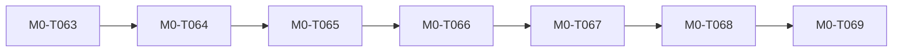

# D-013 context-intelligence status projection

A VIEW generated deterministically from control-plane facts — never source of truth. Regenerate rather than edit.

- generated from: `b086bba6be84ca5fd28d1080568d9f9c21eea421` on `task/M0-T069-benchmark-runbook`
- task index digest: `485733b67826f814…`
- directive index digest: `b491cfdc5fb7787a…`
- staleness: the current HEAD differs from repo_sha or either index digest changes; verify with the `check` subcommand (exit 3 = stale)

| unit task | status | reviewed SHA | gates | rollback point |
|---|---|---|---|---|
| M0-T063 | accepted | `8457b15dd` | G0:PASS, G3:PASS, G4:PASS, G5:PASS | `5c71fe0e0` |
| M0-T064 | accepted | `dc6a72d0b` | G0:PASS, G3:PASS, G4:PASS, G5:PASS | `a89682c85` |
| M0-T065 | accepted | `a222d23f7` | G0:PASS, G3:PASS, G4:PASS, G5:PASS | `67eb9657c` |
| M0-T066 | accepted | `c21dca2dd` | G0:PASS, G3:PASS, G4:PASS, G5:PASS | `af6ba2f4f` |
| M0-T067 | accepted | `a00543910` | G0:PASS, G3:PASS, G4:PASS, G5:PASS | `778884755` |
| M0-T068 | accepted | `4cd727409` | G0:PASS, G3:PASS, G4:PASS, G5:PASS | `1006f16cb` |
| M0-T069 | in progress | `b086bba6b` | G0:PASS | `b086bba6b` |

(The Mermaid graph above is rendered FROM the same JSON projection — a view, never a source of truth.)
